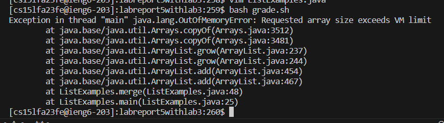
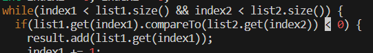
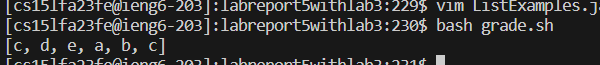

# LabReport5New
**1)** The original post from a student with a screenshot showing a symptom and a description of a guess at the bug/some sense of what the failure-inducing input is. (Don’t actually make the post! Just write the content that would go in such a post) 

Dear TA, 
   I have been working on my merge method within ListExamples.java. The failure-inducing input would probably be the arrays I passed in, when I added the arrays I get an error stating that the heap is not large enough.  
   Best,  
   Student  
 

**2)** A response from a TA asking a leading question or suggesting a command to try (To be clear, you are mimicking a TA here.)
Hello Student,
  Based on your problem and provided code it seems that there is a problem when you are adding to your new merged array. I would recommend going through the conditions used to add to the array, there is likely a problem there.
   Best,
   TA
   
**3)** Another screenshot/terminal output showing what information the student got from trying that, and a clear description of what the bug is.
there was a line of code in TestExamples.java 
 
 

**4)** At the end, all the information needed about the setup including:
- The file & directory structure needed: list-examples-grader which contatins grade.sh and an implementation of ListExamples.java
- The contents of each file before fixing the bug: 
- The full command line (or lines) you ran to trigger the bug `javac ListExamples.java` `java ListExamples`
- A description of what to edit to fix the bug: I had to change the comparison sign from > to < 
